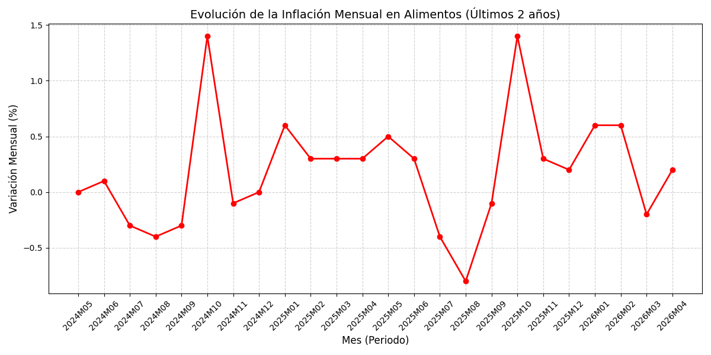

# Análisis de la Inflación en Alimentos (IPC)

Este proyecto automatiza la lectura y el filtrado de los datos oficiales del IPC del Instituto Nacional de Estadística (INE) utilizando **Python** y **Pandas**.

## 🚀 Qué hace este script:
1. Abre de forma visual el archivo de datos bruto del INE (`datos_ipc.csv`).
2. Limpia y filtra los datos centrándose exclusivamente en el sector de **Alimentos y bebidas no alcohólicas**.
3. Exporta un reporte limpio en formato CSV listo para abrir en Excel.
4. Genera automáticamente un gráfico de líneas con la evolución de la inflación.

## 📊 Visualización Automática:
Aquí se muestra la tendencia generada por el script:

## 🛠️ Tecnologías utilizadas:
* Python 3
* Pandas (Procesamiento de datos)
* Matplotlib (Visualización de datos)
